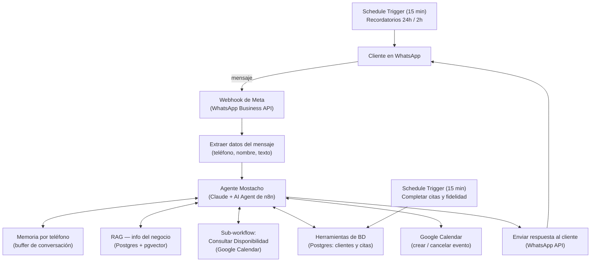

# Mostacho Barbería — Agente de WhatsApp con IA

Agente conversacional por WhatsApp para **Mostacho Barbería** (Ibagué, Colombia), construido en **n8n** con un modelo de **Claude (Anthropic)** como cerebro. Atiende clientes, cotiza servicios, agenda y cancela citas en **Google Calendar**, lleva un **sistema de fidelidad** (servicio gratis cada 6 visitas) y envía **recordatorios automáticos** de 24h y 2h antes de cada cita — todo sin intervención humana, con escalamiento a un asesor cuando el agente no puede resolver algo.

Este repositorio documenta el proyecto completo: arquitectura, base de datos, *prompt* del agente y los workflows de n8n, para que pueda instalarse, revisarse o adaptarse a otro negocio similar.

> Proyecto de portafolio construido para un negocio real como caso de uso, dentro del proceso de aprendizaje y oferta de servicios de automatización con IA del autor.

## El negocio

| | |
|---|---|
| Nombre | Mostacho Barbería |
| Ciudad | Ibagué, Tolima, Colombia |
| Dirección | C.C. Quinta Avenida, Cra 5 No 38-56, Local 10 |
| Canal de atención | WhatsApp |
| Horario | Lunes a sábado, 9:00 a.m. – 7:00 p.m. (domingos y festivos cerrado) |
| Equipo | Joniel, Rubén, Styven, Sergio |

### Servicios

| Servicio | Duración aprox. | Precio |
|---|---|---|
| Corte | 45 min | $30.000 |
| Corte + Barba | 70 min | $45.000 |
| Servicio Especial | 90 min | $60.000 |

Todos los servicios incluyen lavado y mascarilla de puntos negros.

Antes de este proyecto, la barbería agendaba manualmente por teléfono y por la app AgendaPro; no contaba con atención ni agenda automatizada por WhatsApp.

## Qué hace el agente

- **Conversa por WhatsApp** en lenguaje natural, con memoria por número de teléfono (recuerda el hilo de la conversación).
- **Responde con información real del negocio** (horario, precios, servicios, ubicación) usando RAG — nunca inventa datos.
- **Agenda citas**: consulta disponibilidad real contra Google Calendar, ofrece horarios libres, confirma y crea el evento.
- **Cancela o reprograma citas** a pedido del cliente.
- **Registra clientes y citas en una base de datos real** (Postgres), no solo en el calendario.
- **Aplica el programa de fidelidad**: servicio gratis automático cada 6 visitas completadas.
- **Envía recordatorios automáticos** 24 horas y 2 horas antes de cada cita.
- **Marca las citas como completadas automáticamente** cuando ya pasó su hora, y sube el contador de fidelidad sin intervención humana.
- **Escala a una persona del equipo** cuando no sabe resolver algo, en vez de inventar una respuesta.

## Arquitectura



El agente principal corre en un único workflow de n8n (**AI Agent** de n8n con modelo **Claude**), con tres piezas auxiliares:

1. **Sub-workflow de disponibilidad**: recibe fecha/hora/duración/barbero preferido, consulta Google Calendar y calcula qué barberos están libres (o propone alternativas cercanas).
2. **Workflow de recordatorios**: corre cada 15 minutos, revisa citas a 24h y a 2h de distancia, y envía el recordatorio por WhatsApp.
3. **Workflow de fidelidad**: corre cada 15 minutos, marca como "completada" cualquier cita cuya hora de fin ya pasó, y actualiza el contador de visitas del cliente (otorgando el servicio gratis al llegar a 6).

### Stack técnico

- **n8n** (self-hosted en VPS propio con EasyPanel) — orquestación de todo el flujo
- **Claude (Anthropic)** — modelo de lenguaje del AI Agent
- **WhatsApp Business API (Meta)** — canal de entrada y salida de mensajes
- **Google Calendar API** — agenda real, visible para el negocio
- **PostgreSQL + pgvector** — base de datos de clientes/citas y almacén vectorial del RAG (persistente, no en memoria)
- **Google Gemini** — embeddings para el RAG

## Modelo de datos

Dos tablas en Postgres, separadas del calendario (que sigue siendo la agenda visual que usa el negocio):

**`clientes`**

| Columna | Tipo | Notas |
|---|---|---|
| `telefono` | text (PK) | identificador del cliente |
| `nombre` | text | tomado de WhatsApp o dado por el cliente |
| `cedula` | text | opcional |
| `fecha_nacimiento` | date | opcional |
| `membresia_premium` | boolean | activación manual desde mostrador (no vía chat) |
| `contador_visitas` | integer | sube solo cuando una cita se **completa**, no al agendar |
| `servicio_gratis_disponible` | boolean | se activa al llegar a 6 visitas |
| `created_at` / `updated_at` | timestamp | |

**`citas`**

| Columna | Tipo | Notas |
|---|---|---|
| `id` | serial (PK) | |
| `telefono` | text (FK → clientes) | |
| `servicio` | text | |
| `barbero` | text | asignado por el sub-workflow de disponibilidad |
| `fecha_hora_inicio` / `fecha_hora_fin` | timestamp | |
| `estado` | text | `agendada` / `completada` / `cancelada` |
| `es_gratis` | boolean | si se usó el premio de fidelidad |
| `calendar_event_id` | text | enlaza con el evento real de Google Calendar |
| `recordatorio_24h_enviado` / `recordatorio_2h_enviado` | boolean | evita reenviar recordatorios |
| `created_at` | timestamp | |

Ver los scripts completos en [`sql/`](sql/).

## Herramientas del agente (AI Agent tools)

| Herramienta | Tipo de nodo | Qué hace |
|---|---|---|
| Consultar info del negocio (RAG) | Postgres PGVector Store (Retrieve) | Responde horarios, precios, servicios y ubicación con datos reales |
| Consultar disponibilidad | Call n8n Workflow Tool | Llama al sub-workflow de disponibilidad por fecha/hora/servicio/barbero preferido |
| Crear cita en Calendar | Google Calendar Tool | Crea el evento real una vez el cliente confirma |
| Registrar cliente | Postgres Tool | `INSERT ... ON CONFLICT DO NOTHING` en `clientes` |
| Consultar fidelidad del cliente | Postgres Tool | Lee el contador de visitas y si tiene servicio gratis disponible |
| Registrar cita en BD | Postgres Tool | Inserta la cita ya creada en Calendar dentro de `citas` |
| Buscar cita del cliente (BD) | Postgres Tool | Localiza la cita activa del cliente para cancelar/reprogramar |
| Marcar cita cancelada en BD | Postgres Tool | Actualiza `estado = 'cancelada'` |
| Escalar a una persona | WhatsApp (mensaje al equipo) | Avisa al equipo cuando el agente no puede resolver algo |

El *prompt* completo del agente está en [`docs/prompt-del-agente.md`](docs/prompt-del-agente.md).

## Reglas de negocio importantes

- El contador de fidelidad **solo sube cuando la cita se completa** (no al agendar), y la marca de "completada" es automática.
- Google Calendar sigue siendo la agenda visual que el negocio consulta a diario; Postgres es la fuente de verdad para clientes, historial y fidelidad.
- Los datos deterministas que el flujo ya conoce (teléfono, nombre de WhatsApp) **nunca** se piden al modelo vía `$fromAI` — se traen directo del nodo que los extrajo del webhook, para eliminar errores de valores vacíos o alucinados.
- Todas las consultas a Postgres desde las herramientas de IA usan parámetros posicionales (`$1`, `$2`, ...) vía "Query Parameters", nunca interpolación directa de texto en el SQL.

## Lecciones de la migración (de n8n Cloud a VPS propio)

Este proyecto se construyó primero en n8n Cloud (trial) y se migró después a un VPS propio (EasyPanel). La migración reveló una cascada de fallos silenciosos típicos de mover workflows entre instancias — documentados aquí porque se repiten en cualquier migración similar:

1. **Credenciales perdidas por nodo**: al importar/migrar, algunos nodos quedan sin credencial asignada y n8n bloquea la publicación del workflow (por lo que la URL de producción del webhook nunca queda activa), aunque el modo de prueba funcione sin problema.
2. **Suscripción WABA ↔ App de Meta**: una app de Meta nueva no siempre queda enlazada automáticamente a la cuenta de WhatsApp Business para eventos reales; el botón "Probar" de Meta simula el webhook sin pasar por ese enlace, por lo que puede funcionar aunque el enlace real esté roto. Se corrige con un POST a `{BUSINESS_ACCOUNT_ID}/subscribed_apps` en Graph API Explorer.
3. **Nodos "Set"/"Edit Fields" vaciados**: la configuración de campos de algunos nodos se perdió en la migración, rompiendo el mapeo del mensaje entrante sin ningún error visible hasta revisar el nodo a mano.
4. **Referencias a `$json` tras un nodo AI Agent**: después del Agente, `$json` es su propia salida, no el mensaje original — cualquier dato del webhook debe traerse con `$('Nombre del nodo').item.json.campo`.
5. **Vector Store en memoria**: un Simple Vector Store in-memory se vacía por completo en cada reinicio del contenedor. Se migró a **Postgres con pgvector**, que sí persiste.
6. **APIs no habilitadas en el nuevo proyecto de Google Cloud** (ej. Calendar API) tras recrear credenciales tras la migración.
7. **Zona horaria del servidor**: sin `GENERIC_TIMEZONE`/`TZ=America/Bogota` configuradas en el servicio de n8n, las citas se crean con una zona horaria distinta (desfase de 1 hora observado).
8. **Sub-workflows con nodos desconectados**: la migración puede desconectar nodos internos de un sub-workflow sin arrojar error — el trigger recibe los datos pero nunca ejecuta el resto de la cadena, dejando al Agente esperando una respuesta que nunca llega.

**Lección general**: tras migrar un workflow a otra instancia, probar de punta a punta cada tipo de interacción (mensaje simple, pregunta de RAG, agendar, cancelar) en vez de asumir que "ya quedó" — cada pieza puede fallar de forma independiente y silenciosa.

## Instalación

1. Importa los workflows de [`workflows/`](workflows/) en tu instancia de n8n (misma versión de n8n en origen y destino evita que se reseteen expresiones al importar).
2. Ejecuta los scripts de [`sql/`](sql/) en tu base Postgres (con la extensión `pgvector` instalada).
3. Crea las credenciales que pidan los nodos: WhatsApp Business API (Meta), Anthropic (Claude), Google Calendar, Google Gemini (embeddings), Postgres.
4. Configura `GENERIC_TIMEZONE` y `TZ` en `America/Bogota` (o la zona horaria de tu negocio) en el servicio de n8n.
5. Carga la base de conocimiento del negocio en el Vector Store (ver `docs/base-de-conocimiento.md`).
6. Publica el workflow principal y registra la URL de producción del webhook en Meta.
7. Prueba de punta a punta: mensaje simple, pregunta de precios, agendar, cancelar.

## Limitaciones conocidas

- El Vector Store debe recargarse manualmente si se reconstruye desde cero (ya no aplica desde la migración a Postgres/pgvector, que es persistente).
- La activación de la membresía premium es manual, desde el mostrador — no hay flujo de autogestión por chat.
- El número de WhatsApp en producción depende de que el negocio apruebe la migración desde el número de pruebas de Meta al número real.

## Notas de seguridad

Los archivos `.json` de `workflows/` **no** incluyen el contenido de ninguna credencial (solo su nombre e id en n8n), pero antes de subir un export nuevo revisa que no queden tokens, API keys, números de teléfono reales de clientes ni IDs de chat reales — ver [`workflows/README.md`](workflows/README.md).

## Estructura del repositorio

```
mostacho-barberia/
├── README.md
├── LICENSE
├── docs/
│   ├── base-de-conocimiento.md   # documento fuente del RAG
│   ├── prompt-del-agente.md      # prompt de referencia del AI Agent
│   └── img/                      # capturas (agrega las tuyas)
├── sql/
│   ├── 00_extensiones.sql
│   ├── 01_tablas.sql
│   ├── 02_recordatorios.sql
│   └── README.md
└── workflows/
    ├── README.md
    └── (exporta aquí tus .json de n8n)
```

## Autor

Proyecto construido por el autor de este repositorio como parte de su portafolio de automatización con IA (n8n + Claude), Ibagué, Colombia.

## Licencia

MIT — ver [`LICENSE`](LICENSE).
